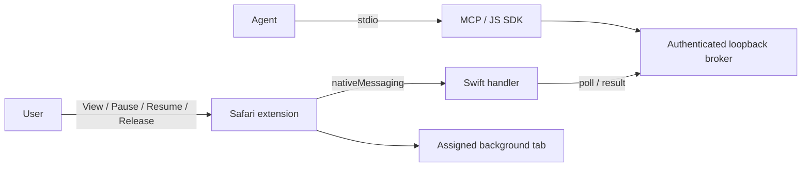

# at-safari

Operate explicitly assigned Safari tabs through MCP, using the website session already in Safari. The task remains a real, visible Safari tab; selecting it pauses agent writes.

**Status: local development alpha (0.1.0-alpha.1).** A Safari Web Extension, Swift native handler, authenticated local broker, and seven callable MCP tools are implemented. The macOS app builds with Xcode. This is an ad-hoc development build, not a signed/notarized public release. See [validation](docs/validation.md) for actual test evidence and remaining gaps.

[中文架构](docs/architecture.md) · [维护](docs/maintenance.md) · [Roadmap](docs/roadmap.md) · [Contributing](CONTRIBUTING.md)

This is an independent MIT-licensed project, unaffiliated with Apple or OpenAI. It does not add a native Safari tab picker to an agent application's composer or claim compatibility with proprietary browser SDKs.

## Architecture



The extension polls through its native handler. Website scripts cannot access the broker API. Pairing uses an expiring code; permanent native credentials stay outside webpage JavaScript. Only explicitly assigned tabs and their authorized origins are available to tools.

## Build

Requirements: Node 22+, pnpm, Python 3, macOS with full Xcode for the Safari app. Tested locally with Node 24 and Xcode 26.6.

```sh
pnpm install --frozen-lockfile --ignore-scripts
pnpm build
pnpm check
pnpm test
python3 scripts/check_repo.py
python3 scripts/build-safari.py
```

The app is generated at `work/DerivedData/Build/Products/Debug/At Safari.app`. Copy it into your Applications folder and open it. For this local ad-hoc build, enable Safari Settings → Developer → Allow unsigned extensions (macOS may require your authentication), then enable **at-safari** in Extensions. Safari may require this development setting again after restarting. Never disable unrelated browser security settings.

## Connect an MCP client

Build first, then configure any local stdio MCP host with this entry, replacing the absolute repository path:

```json
{
  "mcpServers": {
    "at-safari": {
      "command": "/bin/bash",
      "args": ["/absolute/path/at-safari/plugins/at-safari/scripts/run-mcp.sh"]
    }
  }
}
```

The launcher needs Node 22+ on PATH, in a standard Homebrew location, or through `AT_SAFARI_NODE`. The broker starts on demand at `127.0.0.1:19848`. A Codex plugin package is in `plugins/at-safari`; build it before installing via a local marketplace. A fresh Codex task is required to pick up newly installed plugin tools.

1. Call `safari_pairing`. Enter its five-minute code in the **extension popup**, never a webpage.
2. Open the task's Safari tab. Click **Allow agent on this tab** and grant access to that specific website.
3. Switch to another tab. The agent can now read a snapshot and send bounded DOM actions.
4. To inspect or take over, select the task tab or click **View**. Use **Resume** in the popup and switch away again to continue. **Release** removes the assignment; `safari_revoke` removes the paired client.

A local test page is available at `http://127.0.0.1:19848/demo` while the broker is running. It only updates a counter and text inside the page.

## Tools

| Tool | Purpose |
| --- | --- |
| `safari_status` | Connection, assigned tab handles, pause state and limitations |
| `safari_pairing` | Create a short-lived native pairing code |
| `safari_snapshot` | Bounded top-frame text and fresh element references |
| `safari_execute` | 1–10 click, fill, select, scroll or wait operations |
| `safari_navigate` | Navigate within the assigned origin |
| `safari_result` | Inspect a request, including a late result after timeout |
| `safari_revoke` | Revoke a paired extension instance |

Diagnostic invocation through the actual MCP SDK:

```sh
node scripts/call-tool.mjs safari_status
node scripts/call-tool.mjs safari_pairing
node scripts/call-tool.mjs safari_snapshot '{"tabHandle":"handle-from-status"}'
```

Actions require references from a fresh snapshot and an explicit unique request ID. After a timeout marked `unknown`, inspect the original result and page; do not replay a submission with a new ID. Deduplication is in memory for ten minutes and does not survive broker restart.

## Limits and human verification

This alpha uses DOM events, which are not native trusted input. Complex editors, file dialogs, passkeys, screenshots, cross-origin frames, and arbitrary JavaScript execution are unsupported. Existing Safari session state is reused by operating the real page; the bridge does not copy Cookies or promise that every site will avoid login prompts or CAPTCHAs.

Visible challenge signals pause mutations and return `needs_user`. The user completes verification in the original tab and explicitly resumes. Detection is heuristic and cannot identify every challenge. No automatic CAPTCHA solving, verification-token export, or repeated submission is provided. An already-dispatched action cannot be atomically undone when the user takes over.

Runtime credentials are stored under `~/Library/Application Support/at-safari` with restricted permissions. DOM snapshots and job results are held in memory. Treat returned page content as untrusted and potentially sensitive. Same-user local processes are inside the local trust boundary.

## Maintenance

One repository, two delivery units: Safari app + embedded extension/native handler; JS broker + SDK + MCP + plugin. Protocol `0.1` is implemented as an exact-match alpha contract; the richer [protocol draft](packages/protocol/README.md) describes future work and is not the current wire schema.

Licensed under [MIT](LICENSE). Bundled dependency notices are generated alongside the plugin runtime during the build.
