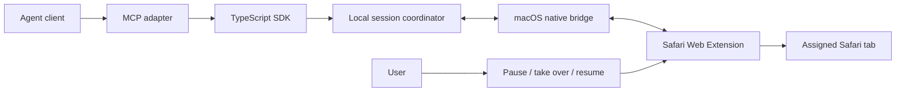

# at-safari

Safari automation for agents, designed around your existing signed-in tabs and uninterrupted browsing.

**Status: architecture and repository scaffold. No working Safari extension, native bridge, MCP server, or installable release exists yet.** Background execution, human handoff, and Safari compatibility must pass the feasibility gates below before a usable release is advertised.

[中文设计与维护说明](docs/architecture.md) · [Roadmap](docs/roadmap.md) · [Protocol draft](packages/protocol/README.md) · [Contributing](CONTRIBUTING.md)

## Intent

Let a person browse Safari tab A while an agent works on an explicitly assigned tab B in the same Safari profile. Reuse the website session already present in Safari. Provide a composable client with tab handles, semantic locators, snapshots, bounded batches, and conditions to wait for.

The design takes inspiration from the organization of browser-agent interfaces. This repository contains an independent implementation plan, not copied proprietary browser automation code. It is not affiliated with Apple or OpenAI. `at-safari` is the project name; a native `@Safari` picker in an agent application's composer is not an implemented feature.

## Proposed architecture



MCP is an integration surface, not the internal browser wire protocol. Session and request handles are explicit, so the design does not depend on one agent client's persistent JavaScript runtime.

## Repository layout

| Path | Responsibility | Current contents |
| --- | --- | --- |
| `apps/safari/` | Web Extension, Swift container, native handler, user controls | Component design |
| `packages/bridge/` | Local session coordinator and authenticated IPC | Component design |
| `packages/protocol/` | Shared wire contract, capabilities and version negotiation | Draft specification and illustrative messages |
| `packages/sdk/` | Composable browser interface | Component design |
| `packages/mcp/` | MCP tools and client-facing errors | Component design |
| `plugins/at-safari/` | Optional Codex packaging | Inactive metadata scaffold only |
| `docs/` | Architecture, maintenance, validation gates | Design documents |

## First feasibility gates

1. Connect a real Safari extension to the local bridge, including background suspension and reconnection.
2. Read an assigned, signed-in tab without activating it.
3. Fill and click in tab B while the user types in tab A; record any tab switch, keyboard interference, or system dialog.
4. Pause a batch for a human challenge, let the user take over the same tab, and revalidate before resuming without replaying a submission.
5. Validate ordinary forms and at least one complex editor separately. A simple form success does not establish universal input support.

The currently inspected Safari 26.4 installation lacks Apple's `safaridriver --mcp` option. This project proposes a Safari extension backend; it does not require that option. No Safari backend has been tested in this repository.

## Human verification

Existing login state does not guarantee fewer challenges. We do not promise automatic CAPTCHA completion or challenge-free operation. The proposed product behavior is to stop mutations, return a structured `needs_user` outcome, keep the assigned tab available, and resume only after an explicit handoff completion and fresh page checks. Failed or ambiguous submissions must not be retried automatically.

Synthetic challenges and vendor test keys belong in automated tests. Production challenge behavior requires consented manual observations and must be reported independently of fixture results.

## Check this scaffold

Python 3.10+ and Git are sufficient for the current repository:

```sh
python3 scripts/check_repo.py
```

This checks repository metadata, JSON syntax, fixture envelope consistency, and local Markdown links. It does **not** validate a browser implementation or prove that the proposed protocol works. Runtime build instructions will be added with working components.

## Release intent

Use one repository and PRs that can update both sides of the contract. Distribute the Safari extension and native app together; version the JS tooling separately. Publish a tested compatibility matrix with every supported combination. See [maintenance](docs/maintenance.md).

Licensed under [MIT](LICENSE).
