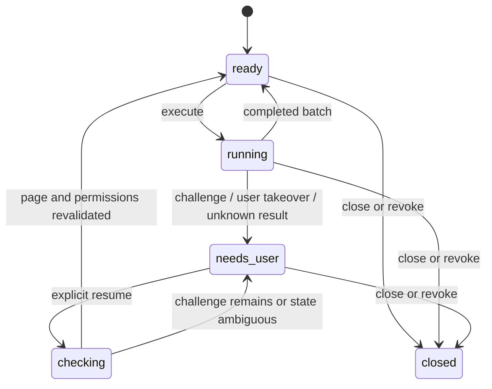

# at-safari：架构与可行性

## 决策与当前证据

选择「Safari Web Extension + Swift 原生桥接 + 本地服务 + SDK/MCP」，目标是使用现有登录状态，在指定后台标签页执行任务。采用单仓库，便于一次 PR 同时修改协议两端。

这是待验证的工程方案，不是已成熟的产品。已确认本地 Safari 26.4、Xcode 26.6 可用；Safari 自带的 MCP 参数不可用。此前独立内置浏览器的测试不能证明 Safari 扩展后台执行可行。

公开资料支持 Safari 扩展脚本注入及与原生组件通信。后台标签页的输入、复杂编辑器、截图和休眠恢复仍需实机验证。Chrome 的 CDP 输入与可访问性接口不能直接移植到 Safari。

## 为什么靠近 Chrome 风格 SDK

上层提供标签页句柄、语义定位器、页面结构快照、条件等待、批量执行和取消。SDK 客户端对象只是方便调用，服务端才是会话状态的权威来源；客户端重连时必须重新核对会话与标签页。

每个动作都使用指定标签页句柄。MCP 面向模型提供有界批次，不能把模型传入的任意 JavaScript 直接当作本地代码执行。第一阶段只支持类型明确的操作，不开放任意代码执行工具。

## 四个边界

1. **Safari 扩展与 Swift 容器**：发现标签页、请求站点权限、页面结构与动作、接管按钮；原生 handler 负责与包含它的 macOS app 通信。扩展实际执行前再次检查权限和当前会话。
2. **本地服务**：拥有会话、租约、请求队列、结果记录、超时与取消；仲裁多个 agent 对同一标签页的请求。
3. **SDK / MCP**：SDK 封装底层请求，MCP 转换工具参数、结果与错误；不重复实现 DOM 逻辑，不持有 Safari Cookies。
4. **共享协议**：定义版本协商、能力声明、消息封装和状态。MCP 版本与内部桥接协议版本分开。

## Safari 原生通信必须先做 spike

Safari 原生消息进入 app extension handler，不能假定它与 Chrome 启动任意 stdio native host 的方式相同。需要实测 extension → handler → app/bridge 的请求、响应及应用到扩展的通知路径。

候选方式是 Swift app 承载桥接，使用受限 App Group / 本地 IPC 连接 JS 服务。具体 IPC 和进程保活方式待实测后通过 ADR 固定；现阶段不宣称双向常驻通道已经成立。不能为保持连接而假定 Safari 的扩展后台脚本永久运行。

默认不监听公网端口。若采用 loopback HTTP/WebSocket，必须验证配对、Origin、请求大小及重放；若采用 Unix socket，必须限制目录和 socket 权限，并保持会话认证。网站脚本不得通过伪造消息启动本地任务。

## 登录状态与并行操作

直接操作用户授权的现有页面。新任务标签页留在同一 Safari Profile 中；新 Profile / 私密窗口不能假定共享登录。部分应用使用 sessionStorage 或页面内存保存状态，需要保留原标签页或单独适配。

共享账号并不隔离服务端状态：退出登录、购物车或同一文档的修改可能影响其他标签页。正常运行不激活标签页或窗口；需要前台动作时返回需要用户接管的结果。

用户选中任务页或在其中交互时撤销写入租约，后续批次暂停。已经发出的单个动作可能存在竞争窗口，必须实测、记录；不能承诺操作中途可原子撤销。被分配的标签页关闭、重建、跨站跳转或权限撤销都应使原句柄失效或重新授权。

## 人机验证与人工接管

检测依赖明确可观察的页面信号和可选站点适配器，不能保证识别所有挑战。未知拦截或反复无效操作触发有界停止，不无限刷新。只出现隐藏验证 iframe 不应直接断言用户必须解题。

触发后停止剩余写操作，返回原因、会话句柄、已完成步骤和人工接管标识。用户主动打开原标签页处理验证；插件不自动抢焦点。保留页面与 Cookies 在 Safari 中，不导出验证令牌、不注入伪造通过状态、不使用解码服务。

用户点击继续后，重新检查标签页身份、站点权限、页面状态和动作前置条件。不能仅因为验证码 iframe 消失就判断已通过。恢复后生成新批次；不得盲目重放此前提交。若点击请求已发出但响应丢失，返回结果未知并要求核验，而不是自动重试。

批次需要人工处理时立即结束当前 MCP 调用并返回结构化状态。以后通过显式会话句柄检查与恢复，避免依赖无限期挂起的 MCP 请求或宿主恰好支持某种通知机制。

## 第一阶段不承诺的能力

- 后台原生可信输入、所有富文本编辑器、跨源 frame、关闭的 Shadow DOM。
- 无激活截图、系统文件选择器、钥匙串、通行密钥和操作系统弹窗。
- 任意生产站点无验证码、自动完成验证码、完整复现 Chrome。
- 第三方 agent 应用里的原生 `@Safari` 标签页选择 UI。

这些能力必须通过能力协商单独报告，不能用一个简单页面测试代替。

## 参考资料

- [Safari 扩展与原生消息](https://developer.apple.com/documentation/safariservices/messaging-between-the-app-and-javascript-in-a-safari-web-extension)
- [Safari 15.4 扩展 API](https://webkit.org/blog/12445/new-webkit-features-in-safari-15-4/)
- [Chrome debugger / CDP](https://developer.chrome.com/docs/extensions/reference/api/debugger)
- [Safari Profile 数据隔离](https://support.apple.com/en-ie/105100)
- [Cloudflare 挑战支持边界](https://developers.cloudflare.com/cloudflare-challenges/reference/supported-browsers/)
- [Turnstile 测试密钥](https://developers.cloudflare.com/turnstile/troubleshooting/testing/)

资料核对日期：2026-09-11。资料描述的平台能力与本仓库的实现状态应分开报告。
